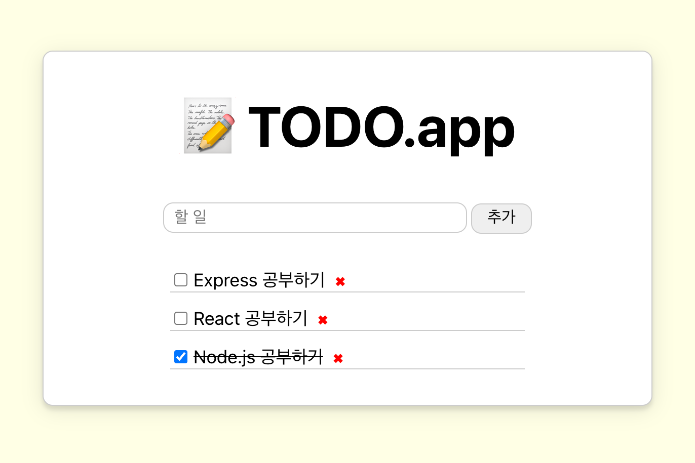

# React로 To-Do 앱 만들어보기

## 기능

- 할 일 조회하기
- 할 일 추가하기
- 할 일 삭제하기

## 데모

https://gint0nic-todo.herokuapp.com

## 스크린샷

## What I Learned

[Wiki](https://github.com/gintooooonic/react-todo/wiki)

## 참고자료

- [React 한글 공식 문서](https://ko.reactjs.org/docs/getting-started.html)
